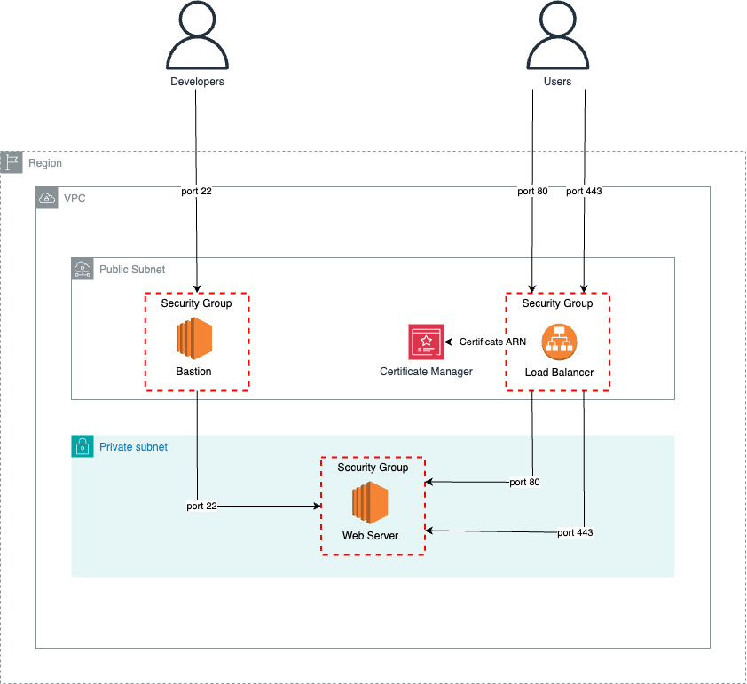

# Web server application using CDK

# Architecture


# Create a virtualenv

```sh
python3 -m venv .venv
```

# Activate the virtual environment

```sh
source .venv/bin/activate
```

# Install dependencies

```sh
pip install -r requirements.txt
```

# EC2 SSH key name
For this deployment we need two ssh key pairs, one for the web server and a second one for the bastion server.

Go to AWS console and then search for EC2, once in the service page on the left menu go to Network & Security and Key Pairs then click on Create key pair.

```sh
export WEB_SSH_KEY_NAME=<web-ssh-key-name>
export BASTION_SSH_KEY_NAME=<bastion-ssh-key-name>
```

# ACM Certificate
In order to enable an https endpoint on the load balancer, we need to have a certificate for a valid domain, on the AWS console search bar, search for Certificate Manager the click on Request and follow the steps on the serice page.

```sh
export CERTIFICATE_ARN=<certificate-arn>
```

# Synthesize the CloudFormation template

```sh
cdk synth
```

# Deploy

```sh
cdk deploy
```